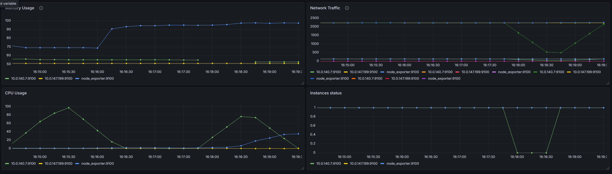
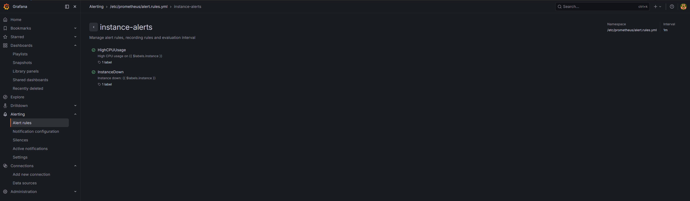
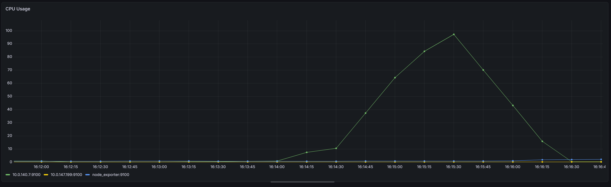
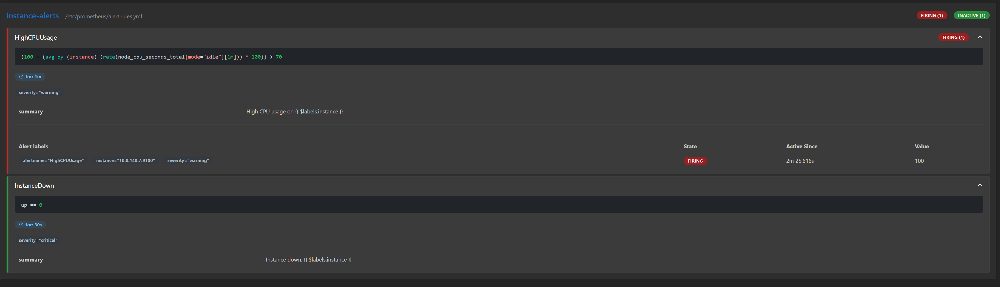
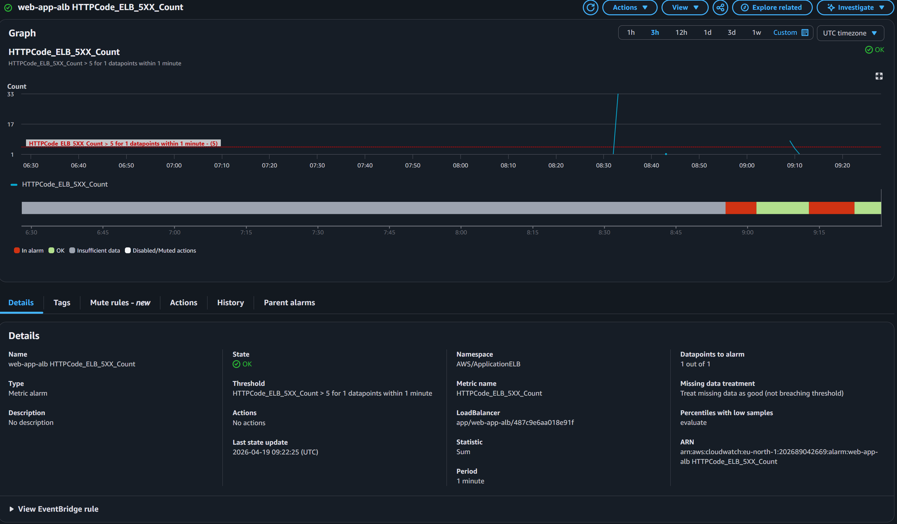
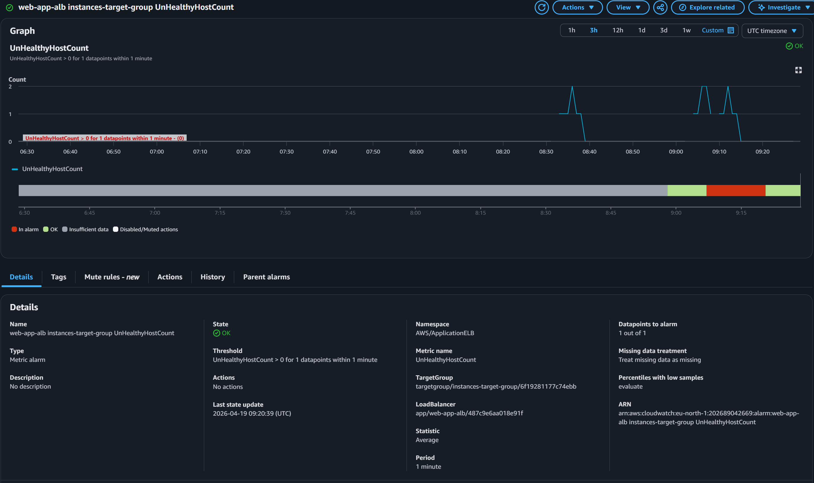

# Production Monitoring & Incident Response System on AWS

## Overview

This project builds on an existing highly available AWS infrastructure:

https://github.com/DanieleSetti/Highly-Available-Web-Application-Infrastructure-on-AWS

It focuses on observability and operations — adding monitoring, alerting, and incident response to transform a running system into observable system.

---

## Architecture

- Monitoring Layer:
- Prometheus (metrics collection)
- Node Exporter (EC2 system metrics)
- Grafana (visualization)
- Alerting rules (incident detection)
- **AWS**: VPC, EC2, Auto Scaling, ALB, RDS, NAT Gateway
- **Monitoring**: Prometheus, Node Exporter, Grafana
- **Backend**: Node.js (Express)
- **Web Server**: Nginx
- **CI/CD**: GitHub Actions

---

## Monitoring Setup

The system collects and visualizes:

- CPU usage (per instance)
- Memory usage
- Network traffic
- Instance availability (`up` metric)

Prometheus scrapes:
- Local node exporter
- EC2 instances in private subnets

Grafana dashboards provide real-time visibility into system behavior.

### 📊 System Dashboard

This dashboard shows:
- multiple EC2 instances simultaneously
- real-time system behavior
- baseline vs abnormal patterns

---

## Alerting

Two core alerts are implemented:

### High CPU Usage
- Trigger: CPU > 70% for 1 minute
- Type: warning

### Instance Down
- Trigger: `up == 0` for 30 seconds
- Type: critical

Alerts are evaluated in Prometheus and visible in both Prometheus and Grafana UI.

### 🚨 Active Alerts Example

This demonstrates:
- alerts firing under real conditions
- automatic resolution after recovery
- severity-based alerting

---

## Incident Scenarios

### 🔴 Incident 1 — High CPU Load

- **Simulation**: `stress --cpu 2 --timeout 120`
- **Detection**: Prometheus alert triggered
- **Investigation**: CPU spike visible in Grafana
- **Root Cause**: artificial CPU load
- **Resolution**: stop stress process
- **Verification**: CPU returns to normal, alert resolves

This shows:
- rapid CPU increase
- peak usage (~100%)
- return to baseline after resolution

---

### 🔴 Incident 2 — Instance Monitoring Failure

- **Simulation**: `docker stop node_exporter`
- **Detection**: `up == 0` alert triggered
- **Investigation**: missing metrics from instance
- **Root Cause**: exporter stopped
- **Resolution**: restart exporter container
- **Verification**: metrics restored, alert resolves

This shows:
- instance becoming unavailable (`up = 0`)
- recovery after restart

---

### 🔴 Incident 3 — Application Failure (ALB perspective)

- **Simulation**: backend failure / instance termination
- **Detection**: ALB metrics and CloudWatch alarms
- **Investigation**: increased error rate / unhealthy targets
- **Resolution**: instance replaced or service restored
- **Verification**: system returns to healthy state

- spikes in HTTP 5XX errors during failure

- unhealthy instances detected by ALB

---

## Key Design Decisions

- Monitoring implemented as a separate layer (no changes to core infra)
- Static Prometheus targets used for simplicity
- Node Exporter deployed via EC2 initialization
- Alerts focus on system-level signals rather than instance identity

---

## Known Limitations

- Prometheus uses static IP targets (not ASG-aware)
- No centralized log aggregation yet
- No Alertmanager integration (notifications)

### Production Improvements

- EC2 service discovery (dynamic targets)
- Alertmanager (Slack / Telegram alerts)
- Centralized logging (ELK / CloudWatch Logs)
- HTTPS and security hardening

---

## What This Project Demonstrates

- Monitoring distributed systems in private networks
- Detecting failures via metrics and alerts
- Understanding system behavior under load
- Handling incidents end-to-end

---

## Documentation

Full infrastructure and architecture details:

👉 `architecture.md`
